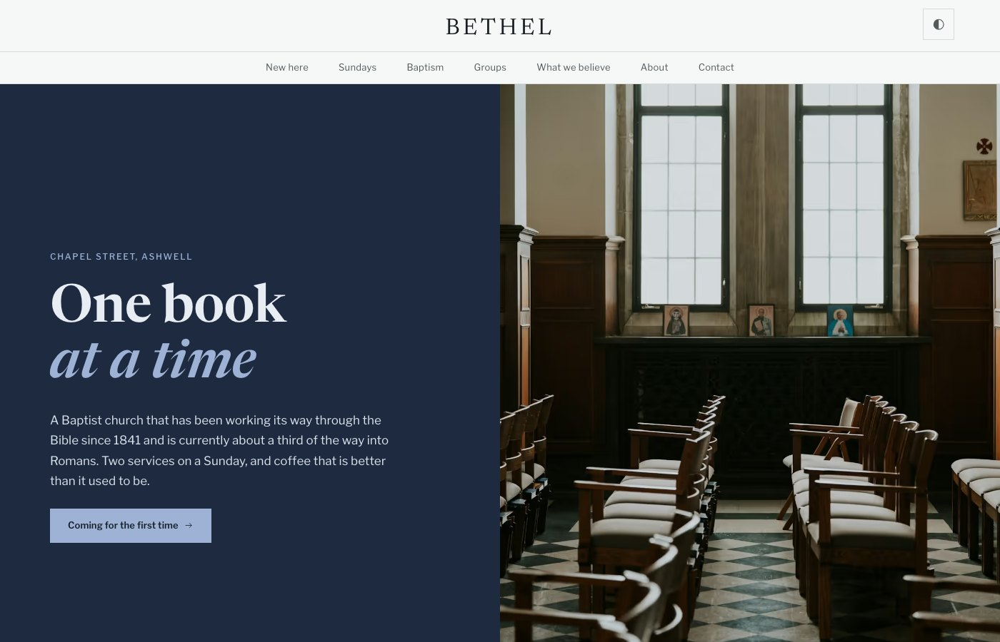
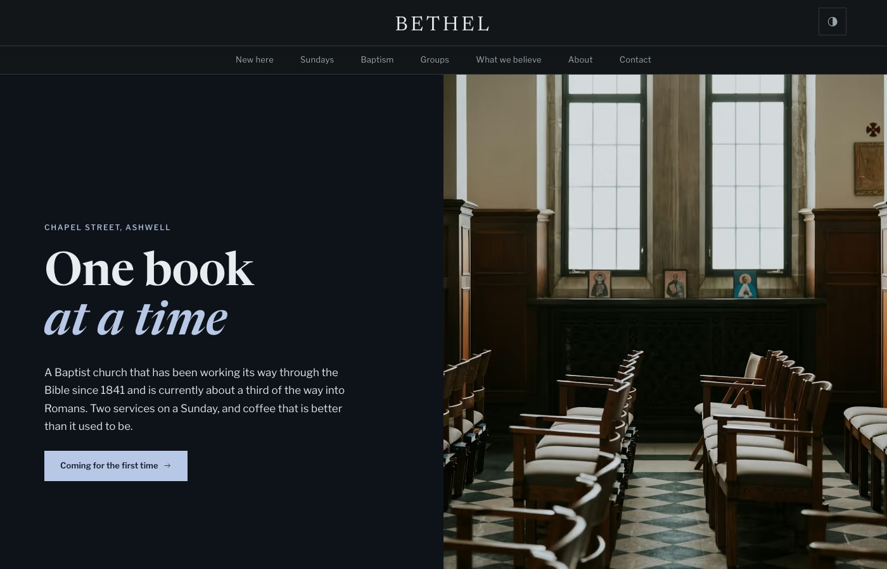
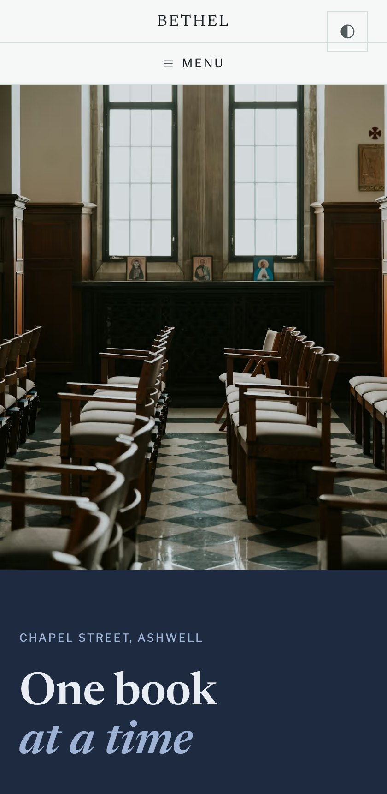

# Bethel — a free church website template for Eleventy

A free website template for evangelical, Baptist and independent churches. Built around the questions a first-time visitor actually asks — what happens on a Sunday, what to expect, what the church believes — with pages for baptism, small groups and a preaching series. Editorial layout, self-hosted typefaces, dark mode, and no external requests.

**[Live demo](https://churchcreation.com/demo/bethel/)** · **[About this template](https://churchcreation.com/templates/bethel/)** · 8 pages · MIT



| Dark mode | On a phone |
|---|---|
|  |  |

## Getting started

Needs Node 18+.

```bash
npm install
npm start
```

Then build:

```bash
npm run build          # writes _site/
```

## Making it your church's

Almost everything a church needs to change lives in one file — **`src/church.config.json`**: name, address, phone, service times, giving link, social accounts. Edit that and the header, footer, contact page, map link and structured data all update together, so they cannot drift apart.

The rest:

| Where | What |
|---|---|
| `src/_includes/base.njk` | the shared layout — header, footer, `<head>` |
| `src/*.njk` | one file per page; the front matter carries its title and description |
| `src/_data/nav.json` | the navigation, rendered by the layout with `aria-current` on the current page |

## What's included

8 pages: Home, About, Baptism, What we believe, Contact, Groups, Sundays, New here.

Self-contained: the typefaces are bundled and self-hosted, the CSS and JS ship with the template, and there are no external requests, no build step for the assets, and no tracking. Dark mode is included and respects the system setting.

## URLs are flat on purpose

Pages build to `about.html` rather than `/about/`. The template's own runtime depends on it: `src/core/js/ui.js` marks the current nav link by comparing the last path segment, and `src/core/js/config.js` fetches `src/church.config.json` by a relative path. Pretty URLs break both. If you would rather have them, change the two accordingly.

## Licence

MIT — see [LICENSE](LICENSE). Use it for your church, for a client, commercially, whatever. Attribution appreciated, not required. Bundled typefaces are SIL OFL 1.1; see `src/core/fonts/FONTS.md`.

The photographs are from [Unsplash](https://unsplash.com/) under the [Unsplash Licence](https://unsplash.com/license), which permits free use, modification and distribution, including commercially. Every photographer is credited in `src/CREDITS.md`. Replace them with pictures of your own church when you have them.

---

One of ten [free church website templates](https://churchcreation.com/templates/) from ChurchCreation. Built for [Eleventy](https://www.11ty.dev/).
